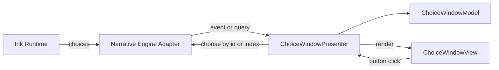

# Visual Novel — Middle Unity Developer Test (Technical Assignment)

This repository contains my written answers and code changes for the **Middle Unity Developer Test**.

- 📄 Test PDF: [`middle-unity-developer-test.pdf`](./middle-unity-developer-test.pdf)
- 🛠️ Task 4 (fixed script): [`Assets/Scripts/TechnicalAssignmentScript/CharactersView.cs`](./Assets/Scripts/TechnicalAssignmentScript/CharactersView.cs)

---

## Contents

- [Where to Find Things in This Repo](#where-to-find-things-in-this-repo)
- [Developer Test Answers](#developer-test-answers)
  - [Task 1 — Principles](#task-1--principles)
  - [Task 2 — Save/Load System](#task-2--saveload-system)
  - [Task 3 — UI Architecture](#task-3--ui-architecture)
  - [Task 3.1 — UI Components](#task-31--ui-components)
  - [Task 4 — Script Fix](#task-4--script-fix)
  - [Task 5 — Entity Tracking and Pooling](#task-5--entity-tracking-and-pooling)
  - [Optional Bonus](#optional-bonus)

---

## Where to Find Things in This Repo

This test is mainly about architecture and reasoning. The key “deliverable” parts are:

- **Test definition:** [`middle-unity-developer-test.pdf`](./middle-unity-developer-test.pdf)
- **Task 4 fix:** [`Assets/Scripts/TechnicalAssignmentScript/CharactersView.cs`](./Assets/Scripts/TechnicalAssignmentScript/CharactersView.cs)

For UI / architecture patterns referenced in Tasks 3–5, I’m reusing the same approach as my other project:

- **Architecture reference repo:** https://github.com/nikita-pogodich/ugolki-technical-assignment

---

# Developer Test Answers

## Task 1 — Principles

### 1) Separation of concerns between gameplay, UI, and data
**Answer:**  
It prevents tight coupling and makes refactors and designer iteration safer. I apply it by keeping game state in services/models, UI as a thin layer that renders state and sends commands, and tunables in ScriptableObjects.

### 2) Data-driven iteration with validation/tooling
**Answer:**  
Designers need to tweak content daily without engineer help. I apply it by putting gameplay values and content in assets, adding editor validation (`OnValidate`, custom inspectors), and making errors obvious before runtime.

---

## Task 2 — Save/Load System

### Goal
A reusable persistence setup that:
- works for general “serializable data”
- handles missing / corrupted files safely
- restores **visual novel narrative state** (Ink)

### Proposed solution

#### File persistence (project-agnostic): `JsonFileSaveStore`
- Takes a `rootDir` (save folder), ensures it exists, sanitizes `slotId`, and reads/writes `<slotId>.json`.
- `Load()` returns `null` if the file is missing → enables graceful “no save found” handling.

#### Clean API + robustness: `SaveLoadManager.Save(slotId)` / `Load(slotId)`
- `Save()` serializes a DTO to JSON using **Newtonsoft.Json** and writes via `ISaveStore`.
- `Load()` wraps deserialization in `try/catch` and returns `false` on corrupted JSON; also returns `false` if deserialization yields `null` (covers missing file / empty data).

#### “Any serializable class” pattern: `SaveLoadUseCases`
Mapping (runtime model ↔ DTO) is separated from storage. Today the serializable class is `SaveData`, but the same pattern supports other DTOs (settings, progress, flags) without changing the store implementation.

#### VN state solved via Ink plugin state JSON
- `SaveLoadManager.Save()` captures Ink runtime state via `INarrativeEngine.GetStateJson()` into `SaveData.NarrativeStateJson`.
- `Load()` restores it via `INarrativeEngine.SetStateJson(...)`, so branching variables / story pointer resume exactly.

Useful docs:
- Ink: https://github.com/inkle/ink  
- Ink Unity Integration: https://github.com/inkle/ink-unity-integration  
- Newtonsoft.Json: https://www.newtonsoft.com/json  

---

## Task 3 — UI Architecture

### Baseline approach
Architecture and code base are based on:  
https://github.com/nikita-pogodich/ugolki-technical-assignment

I use a **WindowManager + MVP** layout:
- **WindowManager**: owns lifecycle (open/close), stacking/layers, focus, input blocking, and transitions.
- Each window is split into:
  - `*WindowPresenter` — orchestration, decisions, business logic
  - `*WindowView` — Unity components, rendering, UI events only
  - `*WindowModel` — state passed from presenter to view (data-only)

This keeps UI code readable and predictable:
- View = “dumb”, Presenter = “smart”
- presenter becomes testable (mock narrative/game services)
- UI windows remain modular and can be reused across scenes

### Example window
To open a window I use my `WindowManager`. Example window components:
- `ChoiceWindowPresenter`
- `ChoiceWindowView`
- `ChoiceWindowModel`

### Typical choice flow (Ink → UI → Ink)

1. Narrative layer produces a list of choices (text + index/id).
2. Presenter converts raw choice data into a UI-friendly model (clean list of items).
3. View renders the list (buttons, scroll list, etc.).
4. Click → View calls Presenter → Presenter calls narrative engine to choose → UI updates.

### Data flow diagram



Why this is useful:
- **Testability:** Presenter logic can be tested without Unity UI
- **Separation:** no story rules inside UI button callbacks
- **Consistency:** every new window follows the same structure
- **Performance control:** UI updates happen intentionally (no accidental per-frame rebuilding)

---

## Task 3.1 — UI Components

Minimum components used for a **Choice Window** UI:
- **Canvas** — root UI rendering
- **CanvasGroup** — show/hide + input gating (`interactable`, `blocksRaycasts`)
- **Image** — window background/panels
- **ScrollRect** — choice list that scales to long content
- **Button** — each choice is a selectable action
- **TextMeshProUGUI** — choice text rendering

Production additions I typically include (if needed):
- `VerticalLayoutGroup` + `ContentSizeFitter` for dynamic lists
- `LayoutElement` for size constraints and stable layout
- `Mask` for scroll viewport clipping
- **Button pooling** (reuse list items) to avoid instantiate/destroy spikes

Docs:
- Unity UI: https://docs.unity3d.com/Manual/UISystem.html  
- TextMeshPro: https://docs.unity3d.com/Packages/com.unity.textmeshpro@latest  

---

## Task 4 — Script Fix

**Fixed script:**  
[`Assets/Scripts/TechnicalAssignmentScript/CharactersView.cs`](./Assets/Scripts/TechnicalAssignmentScript/CharactersView.cs)

### What was fixed / improved

#### Correctness bugs
- `GetComponents<Character>()` was wrong (returns an array and allocates); using direct `Character` references avoids lookup bugs entirely.
- Average was inverted (`count / totalValue`); fixed to `sum / count` and guarded against division by zero.
- List uses `Count`, not `Length`.

#### Performance
- Removed per-update `GetComponent/GetComponents` calls (these are relatively expensive; `GetComponents` also allocates).
- Cached the `Text` component once in `Awake`.
- Removed log spam by making logging optional (and naturally rate-limited by the refresh mechanism).

#### Update frequency
- UI refresh moved from `FixedUpdate()` (physics tick; can run multiple times per rendered frame) to `Update()` with a configurable refresh policy:
  - every N frames, or
  - every X seconds (interval-based, using `Time.unscaledTime` so UI still updates when `timeScale = 0`)

---

## Task 5 — Entity Tracking and Pooling

### Approach: Manager-Based MVP with Object Pooling

To solve tracking/managing gameplay entities efficiently, I use a decoupled manager approach combined with MVP and pooling. The system is split into three services:

- **ResourcesManager**
  - memory-efficient asset loading and instantiation using **Unity Addressables**
  - stack-based object pool to recycle GameObjects (reduce allocations / GC)

- **ViewProvider**
  - bridge between assets and gameplay logic
  - fetches objects from `ResourcesManager`, extracts specific View components, initializes them, and releases back to pool

- **WorldObjectManager**
  - central lifecycle/state tracker
  - creates entities via factories and binds `Model ↔ Presenter ↔ View`
  - tracks alive entities via a dictionary mapping model to presenter (e.g. `_presentersByModel`)

### Fulfilling the requirements

#### 1) Return active entities
The system already tracks alive entities in `_presentersByModel`. Returning active entities is exposing keys:

```csharp
public IEnumerable<IModel> GetActiveEntities()
{
    return _presentersByModel.Keys;
}
```

#### 2) Clean removal and disabling (no `Destroy`)
When a gameplay event happens (e.g., an enemy dies), the system does not use `GameObject.Destroy()`. Instead, `ReleaseWorldObject` is called:

- entity is disabled via `SetShown(false)` (visual + logic)
- factory release cascade returns it to `ResourcesManager`
- `ResourcesManager` reparents to an inactive pool root and pushes back to the stack for reuse

Docs:
- Addressables: https://docs.unity3d.com/Packages/com.unity.addressables@latest  

---

## Optional Bonus

### Q: How would you scale these systems for larger projects?

**A:**

**UI**
- MVP + WindowManager already keeps UI modular
- scale further by making windows more data-driven (ScriptableObject configs for routes/layers)
- load heavy views via Addressables
- isolate features (each feature owns its presenters/views and exposes only small interfaces/events)

**Narrative (Ink)**
- split content by chapter/scene (separate `.ink` files + `INCLUDE`)
- optionally compile multiple story JSONs (per chapter/route) to avoid one monolithic script
- introduce a `NarrativeRouter` that selects an entry knot based on game state (chapter, route, flags)
- make “WorldModes” pluggable via ScriptableObject configs (story assets, entry point, UI skin, rules)
- keep global state + saves versioned and validate Ink variables to prevent content drift

### Q: How would designers interact with this code?

**A:**  
Story can be edited with the **Inky editor** and project `LocalSettings` / ScriptableObjects.

- Inky: https://github.com/inkle/inky

### Q: How would you profile or debug performance issues?

**A:**
- reproduce on target device in a Development Build; capture baseline FPS/frame time
- use Unity Profiler: CPU Timeline, GC Alloc, UI module (layout/rebuild spikes), Rendering/GPU
- bisect by disabling systems (UI updates, logging, entity scans) to find culprit
- add instrumentation (`ProfilerMarker` / `CustomSampler`) around suspected hotspots
- UI checks: Canvas rebuilds, excessive Layout passes, TMP/string allocations, per-frame `GetComponent/Find`
- GPU/render: Frame Debugger, device GPU captures if needed
- memory: Memory Profiler snapshots + diffs to find churn/leaks and large allocations
- re-profile after fixes; add simple perf budgets/tests for key scenes

Docs:
- Unity Profiler: https://docs.unity3d.com/Manual/Profiler.html
- Frame Debugger: https://docs.unity3d.com/Manual/FrameDebugger.html
- Memory Profiler: https://docs.unity3d.com/Packages/com.unity.memoryprofiler@latest
